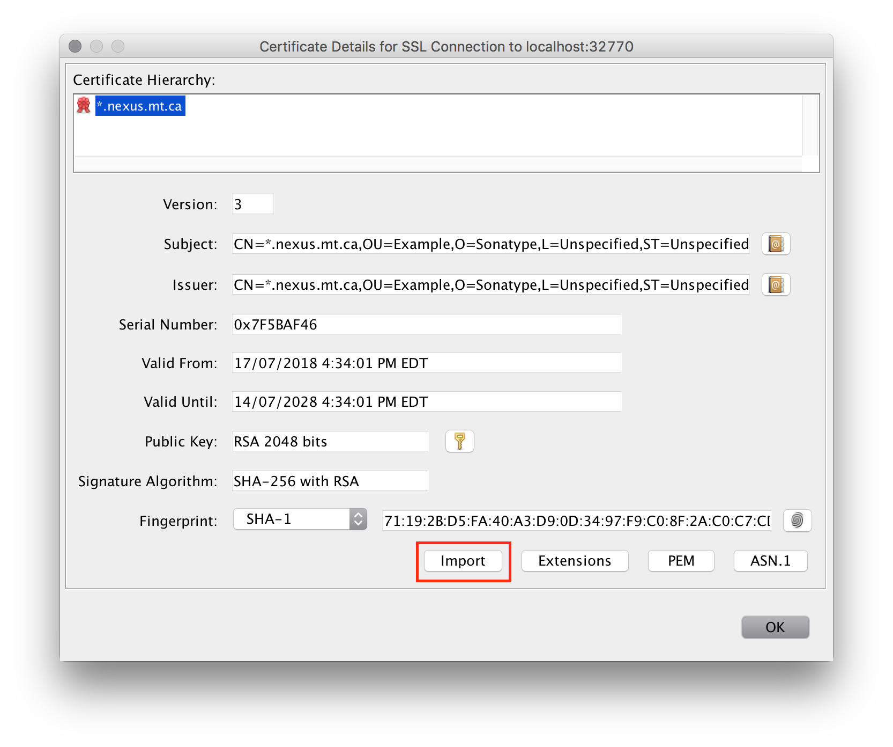

# Accessing a private docker registry with self-signed certificate

Jib relies on the Java Runtime Environment's list of approved _Certification Authority Certificates_ for validating SSL certificates, and will hence fail when connecting to a docker registry that uses a self-signed `https` certificate.  This document describes two approaches for handling registries with self-signed certificates.  Both approaches configure the JRE's list of approved CA Certificates.

These CA Certificates for JRE are managed through a type of a keystore file called _truststore_. An easy way to manipulate truststores is using the [KeyStore Explorer](http://keystore-explorer.org/), an open source GUI replacement for the Java command-line  `keytool` and `jarsigner` utilities. Download and install KeyStore Explorer from the [official website](http://keystore-explorer.org/downloads.html).


## Step 1. Identify Java runtime used by build tool

We must first identify the location of your build-tool's JRE's list of CA Certificates.

### Maven

Run `mvn --version` and take note of the Java runtime location:

```shell
$ mvn --version
Apache Maven 3.5.4 (1edded0938998edf8bf061f1ceb3cfdeccf443fe; 2018-06-18T06:33:14+12:00)
Maven home: /usr/local/Cellar/maven/3.5.4/libexec
Java version: 1.8.0_172, vendor: Oracle Corporation, runtime: /Library/Java/JavaVirtualMachines/jdk1.8.0_172.jdk/Contents/Home/jre
Default locale: en_NZ, platform encoding: UTF-8
OS name: "mac os x", version: "10.13.6", arch: "x86_64", family: "mac"
```

In this example the Java runtime location is `/Library/Java/JavaVirtualMachines/jdk1.8.0_172.jdk/Contents/Home/jre`.

### Gradle

Create an init script with the following:

```
println org.gradle.internal.jvm.Jvm.current().getJavaHome()
```

And run `gradle -I /path/to/script` to output the executing JRE location.

```shell
$ gradle -I /tmp/printjrelocation
/Library/Java/JavaVirtualMachines/jdk1.8.0_172.jdk/Contents/Home

> Task :help 

Welcome to Gradle 4.6.
[...]
```

### JRE vs JDK Distributions

The Maven and Gradle examples above report two different directories, where the Maven example reported a `.../jre` subdirectory.  Java Development Kits usually include a standalone Java Runtime Environment inside the `jre/` directory.  If present, use the `jre/` directory as the runtime location.

## 2. Load JRE CA Certificates

Having identified your Java runtime location:

* Launch `KeyStore Explorer`
* Select _Open an existing KeyStore_
* Navigate to the Java runtime location identified previously, and then continue to open the file at `jre/lib/security/cacerts`.  If there is no `jre/` directory then this is a JRE distribution and should navigate and instead open the file at `lib/security/cacerts`.
  * In the example above, this file would be `/Library/Java/JavaVirtualMachines/jdk1.8.0_172.jdk/Contents/Home/jre/lib/security/cacerts`.
* You will likely be prompted for a password. The default password for the `cacerts` file is `changeit`.

## 3. Import Self-Signed Certificate

If you have the self-signed certificate in a file then:

* Select _Tools > Import Trusted Certificate_
* Select the certifcate file on disk
* Give it a name, or use suggested name, and click _OK_
* Click _OK_ on the success window

Otherwise use _Examine > Examine SSL_ to connect to your service and click the _Import_ button to import its SSL certificate. Then click _OK_.



## 4. Save the CA Certificates

Now we save the updated truststore. We can either save to a new truststore and configure our build's JVM to use this new truststore, or modify the JRE's list of CA Certificates.

#### Option 1: Create a New Truststore

This option creates a _new_ list of CA Certificates and configures your build tool to use this new list as the JRE's list of approved CA certificates.

Within _KeyStore Explorer_, select _File > Save As..._ and save the new truststore file as a _JKS_ file within your project location. You will be prompted for a password; we use `password` in the examples below.

##### Maven

The following snippet shows how to configure Maven to use this new truststore file:

```shell
$ ./mvnw -Djavax.net.ssl.trustStore=path/to/truststore.jks \
  -Djavax.net.ssl.trustStorePassword=password \
  -Dimage=<host>:<port>/<image> jib:build
```

##### Gradle

The following snippet shows how to configure Gradle to use this new truststore file:

```shell
$ ./gradlew jib \
  -Djavax.net.ssl.trustStore=path/to/truststore.jks \
  -Djavax.net.ssl.trustStorePassword=password
```

#### Option 2: Modify the JRE `cacerts`

The other approach modifies the JRE's list of CA Certificates to include the registry's self-signed certificate.  The certificate will be trusted at the JRE level, affecting all Java applications running on it. You must re-import the certificate when you update to a new JRE.

Basically you instruct KeyStore Explorer to save your modified `cacerts` and replace what was previously configured with the JRE.  Depending on your operating system and permissions, you may need to save to a new file and then replace the original `lib/security/cacerts` file with administrative privileges.

